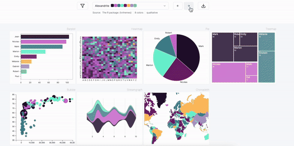
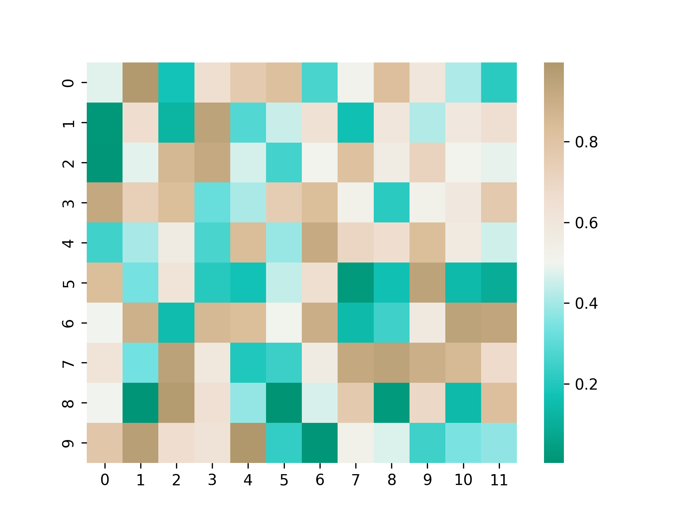

# pypalettes

A large (**+2500**) collection of color maps for matplotlib/seaborn.

All available palettes can be found [on the dedicated website](https://python-graph-gallery.com/color-palette-finder/)

<center>

   
</center>

<br><br>

## Installation

```bash
pip install git+https://github.com/JosephBARBIERDARNAL/pypalettes.git
```

<br><br>

## Quick start

Once the `cmap` is loaded, you can use it as any other color map in `matplotlib` or `seaborn`.

```python
import matplotlib.pyplot as plt
import seaborn as sns
from pypalettes import load_cmap
import numpy as np

data = np.random.rand(10, 12)

cmap = load_cmap('Anemone')

sns.heatmap(data, cmap=cmap)
plt.show()
```



<br><br>

## Getting started

<br>

- Load a color map:

```python
cmap = load_cmap('Chaetodon_sedentarius')
cmap
```


<br>

- Transform a qualitative color map into a continuous one:

```python
cmap = load_cmap('Chaetodon_sedentarius', type='continuous')
cmap
```


<br>

- Invert a color map:

```python
cmap = load_cmap('Chaetodon_sedentarius', reverse=True)
cmap
```


<br>

- Reverse and continuous:

```python
cmap = load_cmap('Chaetodon_sedentarius', reverse=True, type='continuous')
cmap
```


<br>

- Keep only the first 3 colors of a color map:

```python
cmap = load_cmap('Chaetodon_sedentarius', keep_first_n=3)
cmap
```


<br>

- Keep only specific colors of a color map:

```python
from pypalettes import load_cmap

cmap = load_cmap('Chaetodon_sedentarius', keep=[True, True, False, False, True])
cmap
```


<br>

- Load a random color map:

```python
cmap = load_cmap()
cmap
```


<br>

- Find where a color map comes from:

```python
from pypalettes import get_source
get_source('bilbao')
```

`'The R package: {khroma}'`

<br>

- Get hex values of a color map:

```python
from pypalettes import get_hex
get_hex('pupitar')
```

`['#7098C0FF',
 '#88C0E8FF',
 '#285880FF',
 '#B8E0F8FF',
 '#F8F8F8FF',
 '#404060FF',
 '#A8A8A8FF',
 '#C8C8D0FF',
 '#B04000FF']`

<br>

- Get rgb values of a color map:

```python
from pypalettes import get_rgb
get_rgb('AirNomads')
```

`[(255, 153, 51),
 (194, 72, 65),
 (255, 255, 51),
 (139, 91, 69),
 (135, 175, 209),
 (238, 176, 90),
 (219, 197, 160)]`

<br>

- Get the `kind` of a color map:

```python
from pypalettes import get_kind

get_kind('pupitar')
```

`'qualitative'`

<br>

- Error handling:

```python
from pypalettes import load_cmap

cmap = load_cmap('colwarm')
```

`ValueError: Palette with name 'colwarm' not found. Did you mean: 'coolwarm'?
See available palettes at https://python-graph-gallery.com/color-palette-finder/`

<br>

More examples can be found in the [how to use notebook](https://github.com/JosephBARBIERDARNAL/pypalettes/blob/main/how_to_use.ipynb)

<br><br>

## Related projects

`pypalettes` is **highly** inspired from the R package [paletteer](https://github.com/EmilHvitfeldt/paletteer) and the python package [palettable](https://github.com/jiffyclub/palettable).

<br><br>

## How data has been collected

- Sites used
   - https://coolors.co/palettes/trending
   - https://pmassicotte.github.io/paletteer_gallery/

These sites have been scraped with the scripts in `parsers/`. Data is then saved into a `.csv` format with name+palette+source.

Color maps already available in `matplotlib` and `seaborn` have been added to the collection.

Since some color maps have the same name, some specific palettes can be different from the ones expected. If you find a mistake, please open an issue.

The easiest way to find the original source is to use the `get_source()` function, and I highly suggest you to find your dream color map using the [original site](https://python-graph-gallery.com/color-palette-finder/).

<br><br>